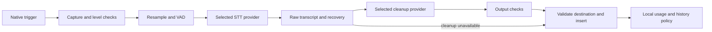
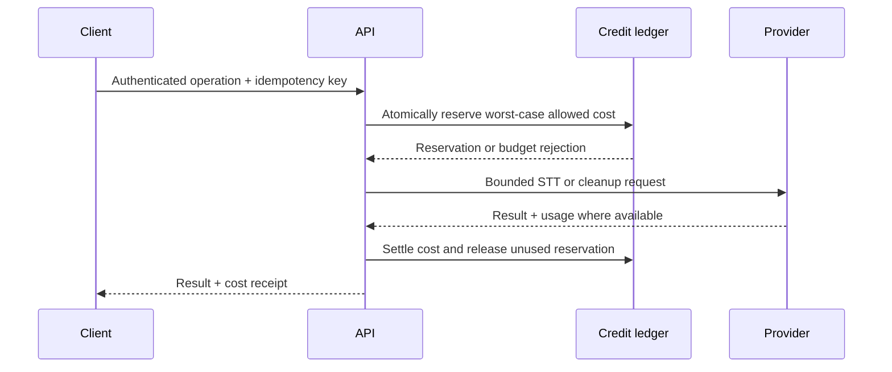

# Recommended architecture

Start with Handy for desktop, native mobile clients, and an optional small managed API. Reuse permissive components selectively. A five-platform Tauri wrapper does not supply keyboard extensions, compositor permissions or a reliable text-insertion contract. React Native could share ordinary mobile screens, but iOS keyboard extensions, Android's accessibility input method and keyboard fallback, audio capture and model execution would still need native code. Swift and Kotlin keep those platform-critical paths direct.

The decision comes from [the core code audit](research/core-repositories.md), [the product reference audit](research/product-repositories.md) and [platform constraints](research/platforms.md). Handy already has native desktop mechanisms, but needs measured Linux hardening. OpenWhispr supplies useful product references; Epicenter's AGPL affects code reuse. None is a verified complete five-platform foundation.

## Components

| Component                        | Initial choice                                                                        | Reason and boundary                                                                                                                                                                                   |
| -------------------------------- | ------------------------------------------------------------------------------------- | ----------------------------------------------------------------------------------------------------------------------------------------------------------------------------------------------------- |
| Desktop settings/history/stats   | Handy-derived Tauri 2, Rust, React/TypeScript                                         | Existing desktop lifecycle, audio and model plumbing. Keep a stable upstream revision and maintain a small, documented fork                                                                           |
| Recording indicator and delivery | OS-specific adapters                                                                  | Native layer shell where supported; permissioned platform APIs elsewhere; no generic web window pretending to be a universal overlay                                                                  |
| Desktop STT                      | Evaluate Handy's `transcribe-cpp`/`transcribe-rs` path first                          | Benchmark Whisper and Parakeet. Keep direct whisper.cpp as a fallback candidate, not a second mandatory runtime                                                                                       |
| Desktop cleanup                  | User-selected Ollama endpoint initially; bounded provider adapter for BYOK            | Easy local model experimentation. Later offer an embedded worker when startup, packaging and memory behavior justify it                                                                               |
| iOS                              | Swift containing app and keyboard extension                                           | Microphone and heavy inference belong in the containing app. The extension handles editing/insertion and state display                                                                                |
| Android                          | Kotlin app with an Android 13+ dictation bubble and an Android 8–12 IME fallback      | The bubble uses an AccessibilityService input connection to insert with the user's usual keyboard. A microphone foreground service starts while Murmur is visible. Local inference remains planned    |
| Local persistence                | SQLite in application-private storage for history                                     | Android stores raw/final text and duration in SQLite, with text export and retention choices. App-private preferences keep settings and the latest result; Android Keystore protects its two API keys. Lecture audio is retained for retry and sharing; durable cost accounting remains planned |
| Managed API                      | TypeScript service, PostgreSQL ledger, fixed provider allowlist                       | One service can authenticate, reserve credit, call STT/cleanup and settle costs. Add queues only when long jobs need them                                                                             |
| Shared material                  | JSON contracts, generated client types, prompt versions, model manifests and fixtures | Avoid forcing identical UI or native lifecycle code across platforms                                                                                                                                  |

The intended source layout is `apps/desktop`, `apps/ios`, `apps/android`, `services/api`, and `packages/contracts`. The desktop MVP and Android app exist. On Android 13 and newer, an optional accessibility bubble appears beside an ordinary focused text field while the user's usual keyboard stays selected. The Murmur IME is available on Android 8–12 and remains an alternative on newer phones. Android offers a configured STT endpoint or the phone's installed on-device speech service, with optional separate text cleanup. It retains raw/final text history and lecture audio. iOS, the managed service and shared contracts remain planned work.

## Pipeline

The diagram is the target pipeline. Android currently records bounded WAV audio for endpoint transcription or uses the system's on-device recognizer. It can apply device noise suppression to its own WAV capture and send raw text through a separately selected cleanup endpoint. It has no VAD, embedded cleanup model or full operation ledger. State transitions are explicit: idle, recording, transcribing, cleaning, ready, inserting, completed, cancelled or failed. A session ID identifies one dictation; an operation ID identifies one provider stage; attempts have separate IDs. Only a final transcript can be inserted. Streaming previews do not repeatedly replace text in the destination.

Capture uses a bounded buffer. Check microphone availability and levels before showing a recording state. Keep pre-roll and end padding around VAD boundaries so short names and final consonants survive. Denoising is a separate optional step; validate it with noisy recordings before enabling it by default. Silence detection must not become a brittle blacklist that deletes legitimate phrases.

Snapshot the destination before showing an indicator. Before delivery, revalidate the active target and field when the platform exposes enough information. If focus changed or identity cannot be established, retain the result and ask the user to insert it explicitly. Do not refocus an arbitrary window or retry paste automatically after an ambiguous delivery. Distinguish `inserted`, `sent_without_acknowledgment`, `copied`, and `failed` in the result model.

## Provider contract

STT accepts audio format, samples/duration, language preference, vocabulary hints, cancellation and a deadline. It returns raw text, language when available, timing segments when available, provider request ID, usage and a typed failure. Timestamp, prompt-hint and streaming support are capabilities, not promises of an OpenAI-compatible URL.

Cleanup accepts raw text, a mode, bounded user vocabulary, explicitly allowed context and a prompt version. It returns final text, finish reason, usage and request ID. The model must not answer the transcript, add facts, execute tools or treat captured app text as instructions. Reject empty, truncated, invalid or clearly altered results; otherwise expose the limitations of heuristic semantic checks. Regression evaluation remains necessary.

Select STT and cleanup independently. `local STT + cloud cleanup` sends text off-device and must be described that way. An unavailable local model cannot silently activate a cloud fallback. A failed cleanup should offer the raw text once, without billing or inserting it twice. Model downloads require verified checksums, interrupted-download recovery, disk-space checks and per-model license notices.

Use a separate process for unstable native inference or packaged cleanup where that makes crash recovery practical. Desktop local endpoints bind to loopback; no remote access is enabled by this setup. A future self-hosted LAN mode needs explicit authentication, TLS and user configuration, particularly on phones.

## Native delivery

Linux capabilities must be probed at runtime. The Hyprland/Sway path uses a layer surface with no keyboard focus, fixed bounded dimensions and no reserved screen area. Global shortcuts, overlay presentation and injection are three separate capabilities. Portals need both interface and backend support. KDE/GNOME may require a different indicator and consented RemoteDesktop/libei path. Always retain a clipboard-only fallback. Do not install input permissions or compositor configuration silently.

On Windows, handle foreground identity, IME composition, Unicode, modifiers, mixed DPI and elevated-target restrictions. On macOS, use a nonactivating panel and permission-aware insertion. Preserve clipboard ownership and all supported formats; restore only if the clipboard is still ours. Timer-based restoration must be treated as a fallback with known limits.

iOS is a release gate, not a webview port. Build the containing recorder and extension using public APIs. Validate a flow where the user opens the recorder, returns to a target app and inserts from the keyboard. A bounded armed session may improve this flow only if it passes device, battery and App Review tests. Do not adopt private UIKit launch/return tricks from references.

On Android 13 and newer, the optional AccessibilityService draws a small accessibility overlay beside a focused editable field. It uses Android's accessibility input method connection to insert at the cursor without replacing the user's keyboard. It checks for password and other sensitive field types, and rechecks the target before insertion; a changed target leaves the last transcript in Murmur for manual recovery. The bubble needs an explicit accessibility disclosure and activation. It does not need the draw-over-other-apps permission. The user starts a microphone foreground service from the visible Murmur activity before switching apps, then taps the bubble to start and stop recording. Android 8–12 uses the Murmur IME, which inserts through its own input connection. Test both paths on devices, including microphone and service restrictions, keyboard changes, secure fields and editor switches.

## Managed service

Keep upstream keys on the server. BYOK clients call providers directly by default; a managed service must not accept arbitrary client-selected upstream URLs. Validate file types, decoded duration, payload size, token caps, provider IDs and account quotas before work. Bound concurrent reservations transactionally. A timeout after provider acceptance is an uncertain billable attempt, not proof of zero spend; reconcile before deciding whether to retry. See [service and costs](research/costs-and-service.md).

Maintain versioned price records, separate provider cost from customer price, and use integer monetary units sufficiently small for fractions of a cent. Aggregate before presenting currency. Do not round every clip up to a cent. The local price calculator is a planning tool, not this ledger.

## Privacy and observability

Default logs should contain operation IDs, durations, models, capability failures and latency, with no audio, transcript, window title, selected text or API keys. Diagnostic export should be previewable and redacted. The current desktop keeps local transcripts and WAV audio until the user deletes them or selects shorter retention; existing saved preferences remain intact. An explicit `.tar.gz` export keeps the source audio and both transcript forms without changing live history. The archive is not encrypted and lossless WAV compression may be modest. Android keeps the latest returned transcript in private preferences, deletes short dictation WAV files after each request, and retains lecture WAV files under the selected history policy. It does not upload existing field text. A future memory-only privacy mode would need a separate recovery design rather than claiming recovery without storage.

Use native secure stores for keys, with a clear locked/unavailable state on Linux. Do not downgrade to plaintext. Context collection is off initially, enabled per app, bounded, never collected from detected secure fields, and previewable before cloud use. Mobile app sandboxing means some desktop context features simply cannot be offered.

Managed audio retention should be as short as technically practical and disclosed. Provider opt-out, region and retention settings need adapter-specific tests. The current Deepgram policy requires an explicit model-improvement opt-out request parameter, documented in [the service report](research/costs-and-service.md). Usage sync should carry aggregates rather than transcript history by default.
